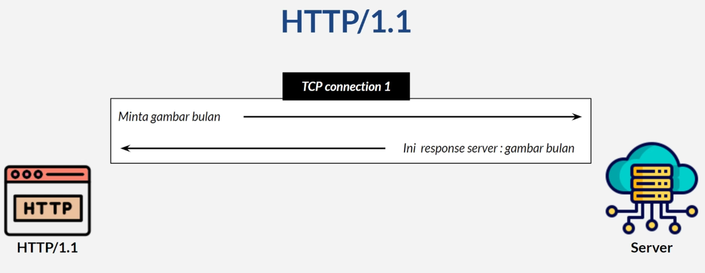
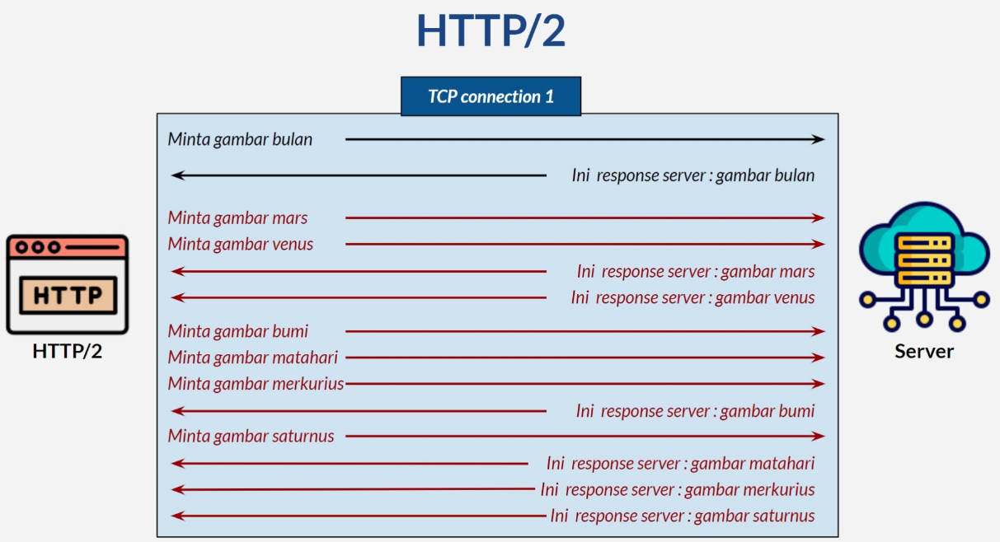
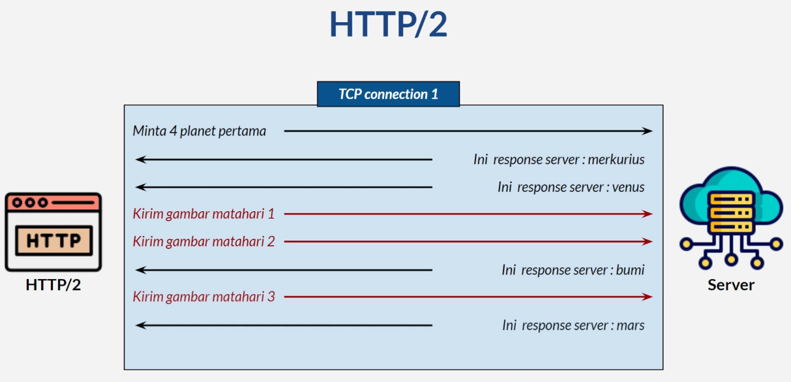
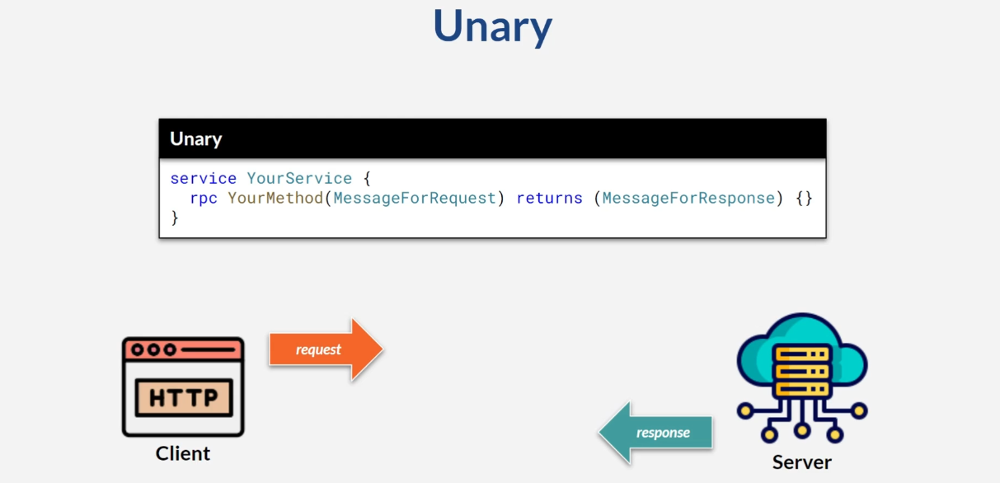
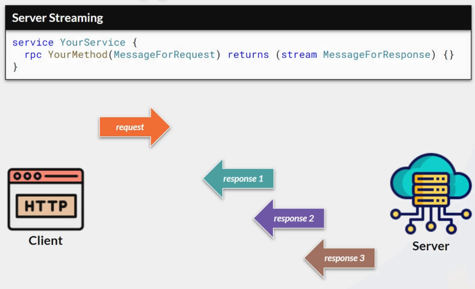
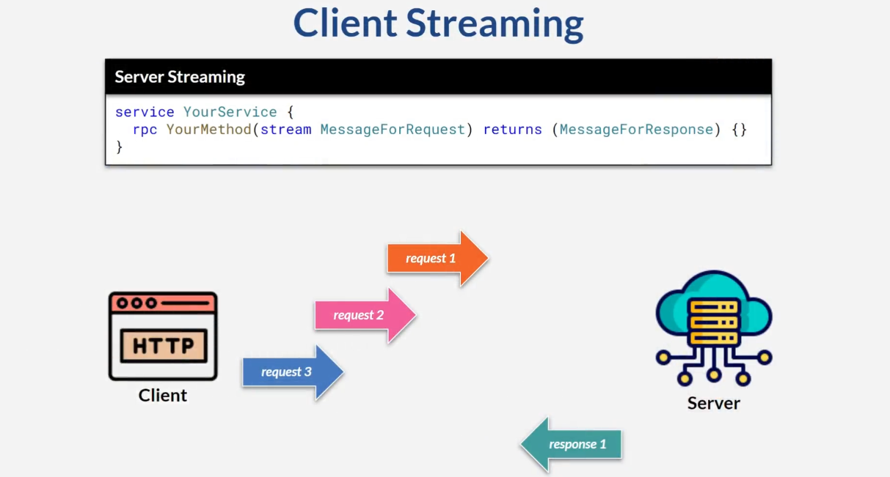

## 1. Makefile
- make execute -> untuk menjalankan grpc server

## 2. Perubahan Protogen
- kalau ada perubahan di repository proto, jangan lupa update dependency nya
```bash
go get github.com/aditya3232/my-grpc-proto@latest  
```

## 3. Tentang gRPC
- gRPC adalah remote procedure call (RPC) framework
- memakai protocol HTTP/2
- kinerja transfer data lebih baik, dengan memakai protocol buffers sebagai format
- default berupa komunikasi secure / encrypted lewat ssl / tls
- mendukung data streaming (di client / server / keduanya)

### REST API vs gRPC
- fokus ke gRPC sebagai komunikasi service-to-service
- pakai gRPC-REST API Gateway yang bisa konversi gRPC sebagai REST API (tulis sebagai gRPC, rilis sebagai gRPC dan REST API)

### gRPC memakai HTTP/2
- support multiplexing request / response memakai single connection
- meningkatkan kinerja efisiensi

- http/1.1
<p align="left">
  
</p>

- http/2
<p align="left">
  
</p>

- http/2 bi-directional
<p align="left">
  
</p>

## 4. Unary
- unary mirip REST API
<p align="left">
  
</p>

### Contoh Use Case
- request-response satu siklus
- cuaca sekarang
- saldo rekening bank
- kirim data ke server

## 5. Server Streaming

<p align="left">
  
</p>

- client mengirim satu request
- server mengirim stream response
- client dapat memproses setiap response yang diterima
- seperti menonton video streaming

### gRPC Server
- tambahkan service memakai protobuf
- buat source code memakai protobuf compiler
- implementasi gRPC server
- jalankan gRPC server

### Contoh Use Case
- realtime data feeds (misal harga saham)
- data transfer yang besar (video/text)

## 6. Client Streaming
<p align="left">
  
</p>

- client mengirim banyak request
- server menerima & memproses masing-masing request
- client selesai mengirim request, lalu server mengirim satu response
- response biasanya berupa logika bisnis berdasarkan semua request yang diterima

### contoh use case
- proses banyak gambar -> misalnya  client mengirimkan banyak gambar, untuk digabungkan oleh server, dan server mengembalikan satu gambar besar atau satu file album
- real time analytics -> misalnya client mengirimkan beberapa data lokasi, server menganalisa lokasi terbaik untuk kriteria tertentu dan mengembalikan 1 rekomendasi lokasi yang direkomendasikan
- sensor data -> pengumpulan data dari sensor, misalnya mengirimkan data sensor setiap detik selama 5 menit

## 7. Bi-Directional Streaming gRPC
- client mengirim banyak request
- server menerima dan memproses setiap request
- server mengirim banyak response

### contoh use case
- untuk analisa data realtime, mengambil tindakan berdasarkan data
- kolaborasi realtime, misal chat atau game multiplayer
- pengumpulan data dari beberapa perangkat IoT device